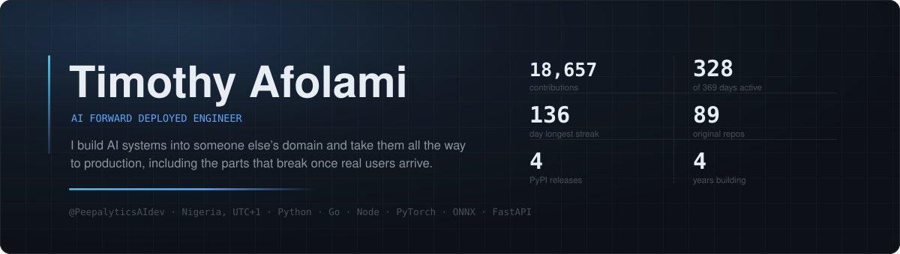
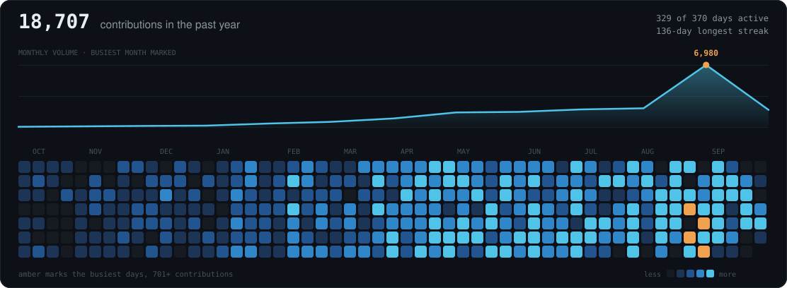

  

## Start here

- 📦 **[markitup-py](https://github.com/timothyafolami/MarkItUp-py)** — Markdown → themed DOCX/PDF/HTML. A deterministic pipeline, not an LLM rebuilding the document each time.  &nbsp;&nbsp;&nbsp;`published on PyPI` `MIT` `CI on every push`
- 🌱 **[bean-lesion-classification](https://github.com/timothyafolami/bean-lesion-classification)** — a model shipped as a system: architectures compared on accuracy *and* latency, then served.  &nbsp;&nbsp;&nbsp;`PyTorch` `ONNX` `FastAPI` `React` `Docker`
- 🛡️ **[PowerShell detection](https://github.com/timothyafolami/Powershell-Malicious-Code-Detection)** — recall-first security ML that ships ranked analyst queues instead of pretending in one threshold.  &nbsp;&nbsp;&nbsp;`scikit-learn` `deobfuscation` `pseudo-labels`
- ⚡ **[Torque-Ripple-AI](https://github.com/timothyafolami/Torque-Ripple-AI)** — physics-informed residual learning small enough to sit inside a real-time control loop.  &nbsp;&nbsp;&nbsp;`PyTorch` `EV PMSM` `feedforward`

## Activity

  

<!--START:streak-->
<!--END:streak-->

## More work

The four above are the ones I'd show first. The rest, by kind.

### ML systems

- 🧠 **[SAMH](https://github.com/timothyafolami/SAMH-Sentiment-Analysis-For-Mental-Health)** — mental-health sentiment analysis behind an API. `FastAPI`
- 🕳️ **[Yolov9-pothole-detection](https://github.com/timothyafolami/Yolov9-pothole-detection)** — road defect detection with YOLOv9. `PyTorch`
- 🌊 **[Flood-Prediction](https://github.com/timothyafolami/Flood-Prediction)** — flood probability modelling. `Python`
- 🧬 **[Brain-Tumor-Image-Detection](https://github.com/timothyafolami/Brain-Tumor-Image-Detection)** — tumour detection from scans. `PyTorch`

### LLM & agents

- 💬 **[ai-chat-simulation](https://github.com/timothyafolami/ai-chat-simulation)** — AI-to-AI persona chat, state machine driven, scored by an LLM reviewer. `LangChain`
- 🗓️ **[AI-AGENTIC-HELPER](https://github.com/timothyafolami/AI-AGENTIC-HELPER)** — daily planning assistant on an agentic loop. `LangChain`
- 🔎 **[RAG Product Recommendation](https://github.com/timothyafolami/RAG---Product-Recommendation-System)** — retrieval-augmented recommendation over a catalogue. `RAG`
- ▶️ **[Youtube_Videos_summarizer](https://github.com/timothyafolami/Youtube_Videos_summarizer)** — transcript → summary, keywords, blog points. `Gemini`
- 🍽️ **[Resturant-Ai](https://github.com/timothyafolami/Resturant-Ai)** — restaurant CRM chat. `Python`
- 🔬 **[MSE-AI](https://github.com/timothyafolami/MSE-AI)** — materials-science assistant. `Python`

### Tools

- 🪟 **[MarkItDown-UI](https://github.com/timothyafolami/MarkItDown-UI)** — browser front-end for Microsoft's MarkItDown. `FastAPI` `TypeScript`
- 🖼️ **[svg-transformer](https://github.com/timothyafolami/svg-transformer)** — SVG → PNG/PDF/HTML, multi-engine with fallbacks. `Python`
- 📨 **[msg_data_extractor](https://github.com/timothyafolami/msg_data_extractor)** — batch Outlook `.msg` extraction to Excel. `Python`

## Stack

<!--START:languages-->
<!--END:languages-->

`FastAPI` `ONNX Runtime` `Docker` `AWS` `GCP` `GitHub Actions` `LangChain` `PostgreSQL` `MongoDB` `Streamlit`

## Now

Working through a ten-layer systems engineering lab — cache behaviour and concurrency at the
bottom, distributed failure and inference economics at the top. Every experiment starts with a
written prediction, so the measurement can prove me wrong.

How this page works

 

`README.md` is generated. Edit [`README.template.md`](README.template.md) instead.

[`scripts/build_readme.py`](scripts/build_readme.py) is stdlib-only and runs daily from
[a workflow](.github/workflows/readme.yml). It renders both SVG cards from the public GitHub
API and fills the marked blocks, so no third-party image host can 404 this page.

Two encoding choices in the activity card. Days are bucketed by **quantile** rather than against
the busiest day — GitHub's own scale would flatten 312 of 366 days into one shade. And **amber
marks the top 1% of days**, which a single-hue ramp buries among the merely busy.

---

  <a href="https://www.linkedin.com/in/timothy-afolami">LinkedIn</a> ·
  <a href="https://twitter.com/timothy_afolami">Twitter</a> ·
  <a href="https://www.kaggle.com/timothyafolami">Kaggle</a> ·
  <a href="mailto:timmyafolami8469@gmail.com">Email</a>
    
  Open to problems in ML systems, LLM infrastructure, and applied AI · rebuilt <!--START:updated--><!--END:updated-->

